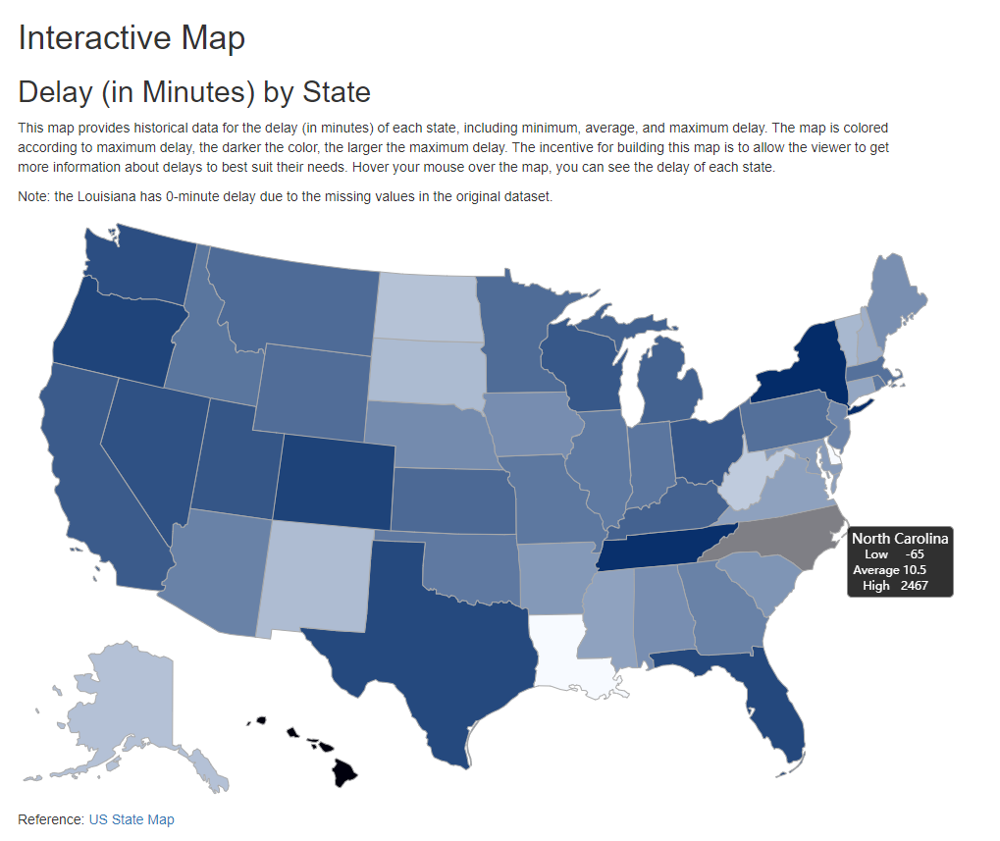

# Interactive component

## The Airline Performance by Each Delay Reason In 2008

Nowadays, flight delays is a tricky problem for travelers. Each time when the travelers meet a delay situation, they are curious about the main reason that caused the flight delay. This interactive bar plot below shows the average delay time and the number of delays by each flight delay reason. Please feel free to click the two bottons below to see the results you want! 
         
<meta charset="utf-8">

<button onclick="update(data1)">Average Delay(mins)</button>
<button onclick="update(data2)"># of Delay(count*1000)</button>

## Interactive Map

This map allows users to view the minimum, average, and maximum delay in minutes of each state in the US with a mouse hover the map. The incentive of building this map is to provide more information of delay by state to help travelers better plan their trip. For example, you will fly to attend a major event. You may book early flights if the average delay and maximum delay of departure state are large. 

This map is colored according to maximum delay (the larger the delay, the darker the color). Compared with the map in Chapter5, Illinois and New Jersey rank highest nationwide for average departure delays. The main airport in Illinois is O'Hare International Airport, the busiest airport in the U.S., and Newark Liberty Airport is also ranked in the U.S.’s 29 busiest airports for departures. In contrast, North Carolina and Hawaii ranked the highest for maximum departure delays. Even if they have a relatively low average delay, their extreme values are significantly larger than other states.

Here is the **link** to the [interactive map](https://rpubs.com/Zhengyi/847437)

The **screenshot** of interactive map:

{width=95%}